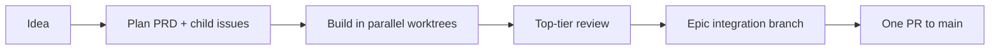

# clex

clex is a self-hosted agentic development orchestrator. It turns a feature idea
into a researched PRD, dependency-aware GitHub issues, parallel agent-built PRs,
and one final human-reviewed PR to `main`. It runs on your own machine, controlled
from Telegram or the CLI, using Claude/Codex subscriptions and local Ollama
models without handing pipeline state to a hosted service.



The full design lives in
[docs/superpowers/specs/2026-07-03-clex-design.md](docs/superpowers/specs/2026-07-03-clex-design.md).

## Install

Homebrew:

```sh
brew tap reissui/tap
brew install --cask clex
```

Go install:

```sh
go install github.com/reissui/clex/cmd/clex@latest
go install github.com/reissui/clex/cmd/clexd@latest
```

Checksum-verifying install script:

```sh
curl -fsSL https://raw.githubusercontent.com/reissui/clex/main/install.sh | sh
```

To pin a version or install into a user-writable directory:

```sh
CLEX_INSTALL_VERSION=v0.1.0 CLEX_INSTALL_DIR="$HOME/.local/bin" \
  sh -c "$(curl -fsSL https://raw.githubusercontent.com/reissui/clex/main/install.sh)"
```

The installer downloads the matching macOS/Linux archive, verifies it against
the release `checksums.txt`, and installs both `clex` and `clexd`.

## Local Setup

Run setup from inside a GitHub-backed checkout:

```sh
clex init
```

Expected flow:

```text
Checking dependencies:
  ✓ claude  ...
  ✓ codex   ...
  ✓ gh      ...
  ! ollama  not found
      fix: install Ollama for local models: https://ollama.com (optional)

Repository: owner/repo
  ✓ labels ensured (pipeline states, epic marker, agent tags)

Telegram setup:
  Create a bot with @BotFather and paste its token (or blank to skip):
  ✓ token valid: @your_bot
  Now message your bot once so we can bind your chat id...
  ✓ bound chat id 123456789

Wrote config scaffold: ~/.clex/config.toml

✓ Setup complete for owner/repo.
  Next: start the daemon, then run `clex status`. File your first idea with:
        clex idea "add a health endpoint" --repo owner/repo
```

For non-interactive setup:

```sh
clex init --yes \
  --repo owner/repo \
  --telegram-token "$TELEGRAM_TOKEN" \
  --chat-id "$TELEGRAM_CHAT_ID"
```

Start the daemon in a terminal:

```sh
clexd --repo owner/repo
```

Submit work:

```sh
clex idea "add a health endpoint" --repo owner/repo
clex status
```

## Remote Hosting

Remote hosting uses the same config. Set up locally, copy `~/.clex/`, then
install the daemon service on the remote machine.

macOS:

```sh
brew tap reissui/tap
brew install --cask clex
rsync -a ~/.clex/ remote-mac:~/.clex/
ssh remote-mac 'clex service install --repo owner/repo && clex service status'
```

Linux:

```sh
curl -fsSL https://raw.githubusercontent.com/reissui/clex/main/install.sh | sh
rsync -a ~/.clex/ remote-linux:~/.clex/
ssh remote-linux 'sudo env PATH=$PATH clex service install --repo owner/repo --user clex && clex service status'
```

Service units are generated from the templates in
[deploy/launchd](deploy/launchd) and [deploy/systemd](deploy/systemd).

## CLI Commands

```text
clex init       Guided setup wizard
clex doctor     Check binaries, auth, tokens, and role resolution
clex service    Install/uninstall/status the launchd or systemd unit
clex idea       File a feature idea as a labelled GitHub issue
clex plan       Queue an issue for planning
clex build      Approve an issue or epic for building
clex status     Show pipeline and daemon state
clex steer      Send steering guidance to an issue or epic
clex models     Show model registry health
clex costs      Show spend and estimate drift
clex pause      Pause new dispatches
clex resume     Resume dispatching
clex gc         Garbage-collect merged worktrees
clex update     Update the clex binary
```

Every command accepts `--json` where machine-readable output is implemented.

## Telegram Commands

| Command | Purpose |
| --- | --- |
| `/status` | Show active issues, gates, and daemon state. |
| `/pause` | Hold new dispatches; running work continues. |
| `/resume` | Resume dispatching. |
| `/stop <issue>` | Cancel one running issue and preserve its worktree. |
| `/steer <issue> <text>` | Send guidance to a running or idle issue. |
| `/models` | Show available models and provider health. |
| `/costs` | Show current epic and daily spend estimates. |

Progress messages stay one line. Plan and cost questions use confirm-or-alter
buttons so the default path is a single tap.

## Config

The global config is `~/.clex/config.toml`; a repo may add `.clex/config.toml`
as a shallow overlay.

```toml
[providers.claude]
kind = "claude-cli"

[providers.codex]
kind = "codex-cli"

[providers.ollama]
kind = "ollama"
autodetect = true

[models]
opus-4-8 = { provider = "claude", billing = "subscription" }
gpt-5-5 = { provider = "codex", billing = "subscription" }
qwen3-coder = { provider = "ollama", billing = "free" }

[tiers]
top = ["opus-4-8", "gpt-5-5"]
local = ["qwen3-coder"]

[routing.plan]
tier = "top"
effort = "max"

[routing.build]
policy = "auto"

[routing.review]
tier = "top"
```

See [docs/config-reference.md](docs/config-reference.md) for every key.

## Security Notes

- Only owner- or clex-authored GitHub content drives pipeline actions.
- Issue verification commands are honored only from trusted authors; otherwise
  the repo default command runs.
- Runner child processes receive allowlisted environments. Anthropic API
  credentials are stripped so subscription CLI auth cannot silently become
  metered API usage.
- Work runs in issue worktrees, never in the primary checkout, and clex never
  pushes `main`.
- Telegram checks the configured sender id on messages and callbacks.
- Config, database, IPC socket, and image spool paths use owner-only
  permissions.
- Full-permission runner modes are opt-in config choices. `clex doctor` warns on
  over-scoped GitHub tokens and missing branch protection.

## Troubleshooting

Run:

```sh
clex doctor --repo owner/repo
```

Exit codes:

| Code | Meaning |
| --- | --- |
| `0` | Healthy, or warnings only. |
| `1` | Command usage or ordinary command failure. |
| `2` | Doctor found a blocking problem. |

Common fixes:

```sh
gh auth login
claude login
codex login
ollama list
clex service status
```

For deterministic integration tests and local release validation:

```sh
go test -tags e2e ./e2e/...
goreleaser check
sh packaging/test-install.sh
```
